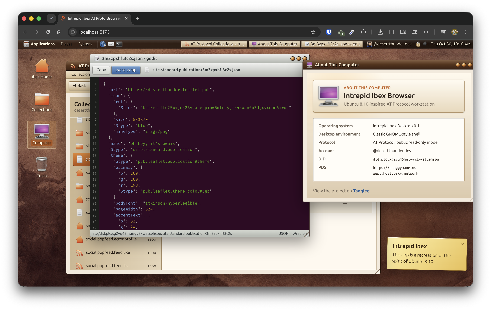

# Intrepid Ibex

A recreation of Ubuntu 8.10 as an ATProto browser. Inspired by
[docs.surf](https://docs.surf).

## Apps

### Nautilus

The main ATProto browser. It lists repo collections, mirrors them in Places, and
opens records from the selected collection.

### About

A small “About This Computer” window with OS, account, DID, PDS, and project links.

### GEdit

A read-only JSON viewer for records. It opens from Nautilus, supports copy and word
wrap, and uses a native GTK-style window.

## Theme

The desktop follows Ubuntu 8.10 and classic GNOME: Humanity icons, Ubuntu fonts,
brown panels, tan window chrome, desktop shortcuts, and draggable/resizable windows.

Syntax highlighting uses a JSON-only Shiki bundle with an Ubuntu terminal palette
based on the Base 16 spec.

## Credits

- Ubuntu 11 ([duh](https://archive.org/details/ubuntu-11.10-desktop-i386-20110812))
- Atmosphere app logos are adapted from
  [atmologos](https://tangled.org/cozylittle.house/atmologos).
- Atmosphere [info](/src/routes/docs/atmosphere.md) adapted from
  [Atmosphere Account](https://atmosphereaccount.com/).
